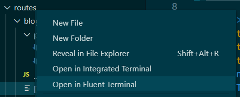

## Features

**Explorer context menu**

Open a Fluent Terminal Tab using the default profile on a folder via the explorer's right click context menu.



**WSL Remote support**

The context menu also works in [WSL remotes](https://marketplace.visualstudio.com/items?itemName=ms-vscode-remote.remote-wsl), regardless of whether the terminal profile is WSL or not.

## Requirements

- [Fluent Terminal](https://www.microsoft.com/en-us/p/fluent-terminal/9p2krlmfxf9t) 

## Tips

If you do not use the integrated terminal you can change the built-in "Open in Terminal" context menu in the Explorer to open Windows Terminal's default profile by using these settings:

```json
"terminal.explorerKind": "external",
"terminal.external.windowsExec": "flute"
```
